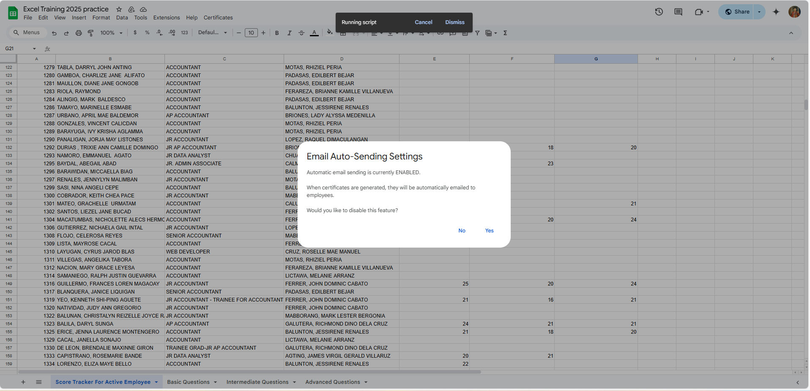
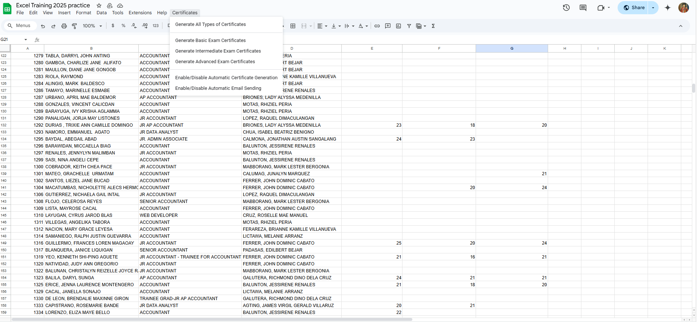
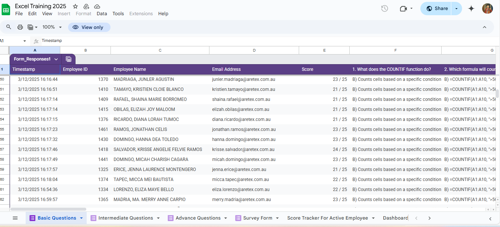
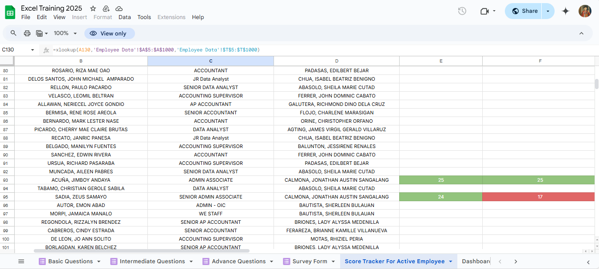
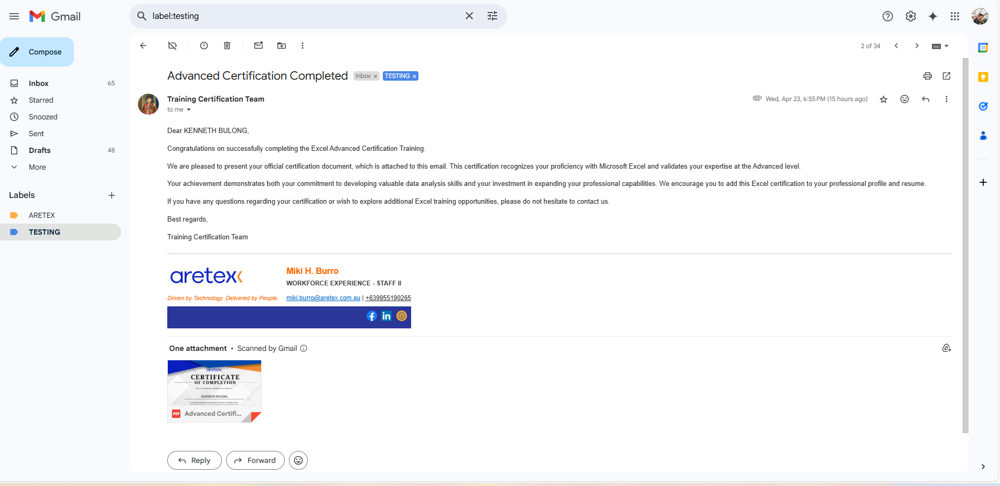
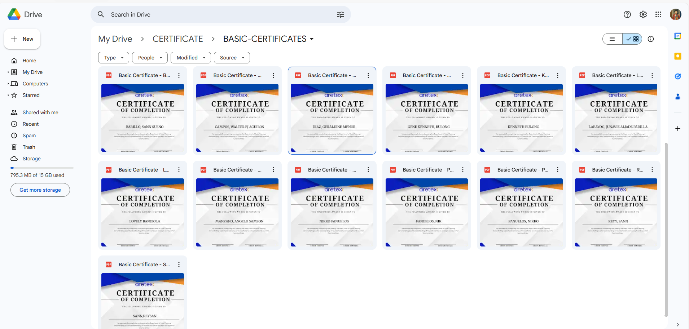
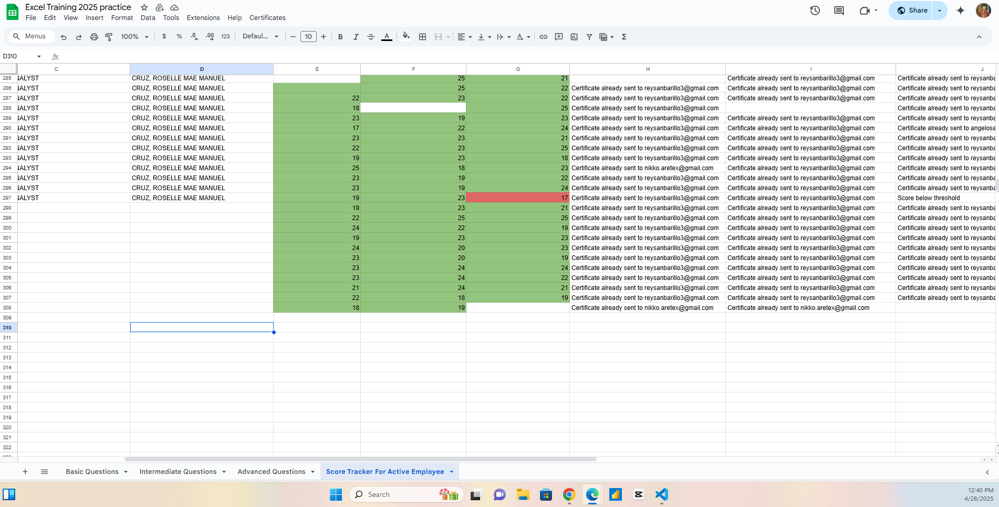

# Certificate Automation Script for Excel Training

This project is a Google Apps Script designed to automate the generation and emailing of certification documents for **Excel Training** based on employee performance data in a Google Sheet. The script integrates with Google Sheets, Google Drive, and Gmail to streamline the certification process.

---

## Features

1. **Automatic Certificate Generation**:
   - Certificates are generated when a score cell is highlighted green in the Google Sheet.
   - Supports three certification levels: Basic, Intermediate, and Advanced.

2. **Email Integration**:
   - Automatically emails the generated certificates to employees.
   - Includes a customizable email template with a professional signature and branding.

3. **Duplicate Prevention**:
   - Checks for existing certificates in Google Drive to avoid duplicates.

4. **Customizable Settings**:
   - Enable or disable automatic certificate generation.
   - Enable or disable automatic email sending.

5. **Bulk Certificate Generation**:
   - Generate certificates for all employees or specific certification levels.

6. **Status Column Updates**:
   - Tracks the progress of certificate generation and email sending in a designated status column:
     - **"Certificate already sent to [email]"**: Indicates that the certificate has already been emailed.
     - **"Generating Certificate"**: Indicates that the certificate is being generated.
     - **"Failed Score"**: Indicates that the score did not meet the required threshold.
     - **"Error during certificate generation"**: Indicates an error occurred during the process.
     - **"Certificate is available (Email not sent - auto-email disabled)"**: Indicates that the certificate has been generated and saved to Google Drive but not emailed.

---

## Additional Notes

- Certificates that are generated but not yet sent will only be saved to Google Drive. The status for such certificates will be **"Certificate is available (Email not sent - auto-email disabled)"**.
- To send these certificates to the employee's email, you need to first enable the **Email Auto-Sending** option in the **Certificate UI Menu**. After that, generate the certificates again (e.g., **Generate Basic Certificates**). Don't worry, it will not generate a new certificate; instead, it will send the certificate that has already been generated but not yet sent to the employee's email.
- To generate certificates for specific types (e.g., Basic, Intermediate, or Advanced), select the corresponding option in the **Certificate UI Menu** based on the type of exam you want to generate the certificate for.
- If you want to generate certificates but not send them to the employee's email, disable the **Email Auto-Sending** option in the **Certificate UI Menu**.
- If you enable **Certificate Auto-Generation**, when you input a score, it will automatically generate a certificate and send it to the employee's email if **Email Auto-Sending** is enabled. If **Email Auto-Sending** is disabled, it will only generate the certificate and save it to Google Drive. To generate a single certificate for an employee without sending it via email, first disable **Email Auto-Sending**, then enable **Certificate Auto-Generation**.
- Once the certificate is sent, the status will update to **"Certificate already sent to [email]"** (e.g., **"Certificate already sent to reysanbarillo3@gmail.com"**).
---

## Screenshots

### 1. **Certificate Auto-Generation Settings**


### 2. **Email Auto-Sending Settings**


### 3. **Custom Menu for Certificates**


### 4. **Basic Questions Sheet**


### 5. **Score Tracker for Active Employees**


### 6. **Generated Email Example**


### 7. **Generated Certificates in Google Drive**


### 8. **Status Column Updates**


---

## File Structure

```
Automation/
├── Automation.js
├── images/
    ├── certificate-auto-generation-settings.png
    ├── email-auto-sending-settings.png
    ├── custom-menu-for-certificates.png
    ├── basic-questions-sheet.png
    ├── score-tracker-for-active-employees.png
    ├── generated-email-with-footer.png
    ├── generated-certificates-in-google-drive.png
    ├── status-column-updates.png
```

### Key File:
- **Automation.js**: Main script file containing the logic for certificate generation, email sending, and menu integration.

---

## Setup Instructions

### 1. **Prerequisites**
   - A Google Workspace account with access to Google Sheets, Google Drive, and Gmail.
   - A Google Sheet with employee data, including names, scores, and email addresses.

### 2. **Open Google Apps Script**
   - Open the Google Sheet where you want to use this script.
   - Navigate to `Extensions > Apps Script`.

### 3. **Add the Script**
   - Copy the contents of Automation.js and paste it into the Apps Script editor.

### 4. Set Up Certificate Templates in Google Docs
- Create Google Docs templates for each certification level:
  - Basic Certificate Template
  - Intermediate Certificate Template
  - Advanced Certificate Template
- Update the template IDs in the script with the corresponding Google Docs template IDs:
  ```javascript
  const BASIC_TEMPLATE_ID = 'YOUR_BASIC_TEMPLATE_ID';
  const INTERMEDIATE_TEMPLATE_ID = 'YOUR_INTERMEDIATE_TEMPLATE_ID';
  const ADVANCED_TEMPLATE_ID = 'YOUR_ADVANCED_TEMPLATE_ID';
  ```
- Ensure that each template contains placeholders like `<<NAME>>` and `<<DATE>>` for dynamic content replacement.

### 5. **Set Up Email Templates**

- Customize the email body and signature to match your organization's branding.
- The email template is defined in the script as `htmlBody`. It includes placeholders for dynamic content such as the employee's name and certification type.
- Example email template:

  ```javascript
  const htmlBody = `
    <div style="font-family: Arial, sans-serif; line-height: 1.6;">
      <p>Dear ${certData.name},</p>
      <p>Congratulations on successfully completing the Excel ${certData.examType} Certification Training.</p>
      <p>We are pleased to present your official certification document, which is attached to this email. This certification recognizes your proficiency with Microsoft Excel and validates your expertise at the ${certData.examType} level.</p>
      <p>Your achievement demonstrates both your commitment to developing valuable data analysis skills and your investment in expanding your professional capabilities. We encourage you to add this Excel certification to your professional profile and resume.</p>
      <p>If you have any questions regarding your certification or wish to explore additional Excel training opportunities, please do not hesitate to contact us.</p>
      <p>Best regards,</p>
      <p>Training Certification Team</p>
      <hr style="border: 0; border-top: 1px solid #cccccc; margin: 20px 0;">
      
      <!-- Email Signature -->
      <table cellpadding="0" cellspacing="0" border="0" style="font-family: Arial, sans-serif; max-width: 500px;">
        <tr>
          <!-- Left column with logo -->
          <td style="vertical-align: top; width: 150px;">
            
          </td>
          
          <!-- Right column with name and title -->
          <td style="vertical-align: top; padding-left: 15px;">
            <div style="font-size: 16px; font-weight: bold; color: #ff6600;">
              Miki H. Burro
            </div>
            <div style="font-size: 12px; font-weight: bold; color: #333333; margin-top: 2px; margin-bottom: 4px;">
              WORKFORCE EXPERIENCE - STAFF II
            </div>
          </td>
        </tr>
        
        <!-- Tagline and contact info row -->
        <tr>
          <td style="font-size: 11px; color: #ff6600; font-style: italic; padding-top: 5px; white-space: nowrap;">
            Driven by Technology. Delivered by People.
          </td>
          <td style="vertical-align: top; padding-left: 15px; padding-top: 5px;">
            <div style="font-size: 12px;">
              <a href="mailto:miki.burro@aretex.com.au" style="color: #0066cc; text-decoration: none;">miki.burro@aretex.com.au</a> | 
              <span>+639955190265</span>
            </div>
          </td>
        </tr>
        
        <!-- Social media row -->
        <tr>
          <td colspan="2" style="padding-top: 5px;">
            <div style="background-color: #2a3698; padding: 8px; text-align: right;">
              <a href="https://www.facebook.com" style="display: inline-block; margin-right: 5px;">
                
              </a>
              <a href="https://www.linkedin.com" style="display: inline-block; margin-right: 5px;">
                
              </a>
              <a href="https://www.aretex.com.au" style="display: inline-block;">
                
              </a>
            </div>
          </td>
        </tr>
      </table>
    </div>
  `;
  ```

- Replace placeholders like `${certData.name}` and `${certData.examType}` with dynamic values from your script.
- Update the logo, contact information, and social media links to reflect your organization's details.
- This template is used in the following functions:
  - **`generateCertificatesByType()`**: Generates certificates for a specified exam type (e.g., Basic, Intermediate, or Advanced) by processing the corresponding rows in the Google Sheet and optionally sending the certificates via email.
  - **`generateSingleCertificate()`**: Handles the creation of a single certificate and optionally sends it via email.
  - **`processAutoGenerateCertificate()`**: Processes the automatic generation of certificates based on the script's properties.

### 6. **Authorize the Script**
   - Save the script and run any function (e.g., `onOpen`) to trigger the authorization process.
   - Grant the necessary permissions.

### 7. **Enable Triggers**
   - Set up a trigger for the `onEdit` function to monitor changes in the Google Sheet:
     - Go to `Triggers` in the Apps Script editor.
     - Add a new trigger for `onEdit`.

### 8. Set Up Destination Folders for Certificates

- Create separate folders in Google Drive for storing certificates based on certification levels:
  - **Basic Certificates Folder**
  - **Intermediate Certificates Folder**
  - **Advanced Certificates Folder**
- Get the folder IDs for each of these folders:
  - Right-click on the folder in Google Drive and select **Get Link**.
  - Extract the folder ID from the link. For example, if the link is `https://drive.google.com/drive/folders/1A2B3C4D5E6F7G8H9I`, the folder ID is `1A2B3C4D5E6F7G8H9I`.
- Update the `destFolderId` in the script for each certification level:
  ```javascript
  if (column === BASIC_SCORE_COLUMN) {
      examType = 'Basic';
      scoreColumn = BASIC_SCORE_COLUMN;
      templateId = BASIC_TEMPLATE_ID;
      // Update this folder ID with the ID of the "Basic Certificates" folder in Google Drive
      destFolderId = "1giX-nYnriLX9IemmGpNXHiCtafProbTo";
      questionSheetName = 'Basic Questions';
      statusColumn = 8; 
  } else if (column === INTERMEDIATE_SCORE_COLUMN) {
      examType = 'Intermediate';
      scoreColumn = INTERMEDIATE_SCORE_COLUMN;
      templateId = INTERMEDIATE_TEMPLATE_ID;
      // Update this folder ID with the ID of the "Intermediate Certificates" folder in Google Drive
      destFolderId = "171I3Ll59dNHCFxhE7wkg3GPxtfwg_fnv";
      questionSheetName = 'Intermediate Questions';
      statusColumn = 9; 
  } else if (column === ADVANCED_SCORE_COLUMN) {
      examType = 'Advanced';
      scoreColumn = ADVANCED_SCORE_COLUMN;
      templateId = ADVANCED_TEMPLATE_ID;
      // Update this folder ID with the ID of the "Advanced Certificates" folder in Google Drive
      destFolderId = "1f0XCRnGgmFPkOVsHHilm7B8Z5er3keic";
      questionSheetName = 'Advanced Questions';
      statusColumn = 10; 
  } else {
      return;
  }
  ```
- Replace the placeholder folder IDs (`YOUR_BASIC_CERT_FOLDER_ID`, etc.) with the actual folder IDs from your Google Drive.

---

## Usage

### 1. **Custom Menu**
   - After setup, a new menu called `Certificates` will appear in the Google Sheet.
   - Use this menu to:
     - Generate certificates for all employees or specific levels.
     - Enable/disable automatic certificate generation.
     - Enable/disable automatic email sending.

### 2. **Highlight Cells**
   - Highlight a score cell green to trigger certificate generation.

### 3. **Status Column**
   - The script updates the status column to track the progress of certificate generation and email sending:
     - **"Certificate already sent to [email]"**: Indicates that the certificate has already been emailed.
     - **"Generating Certificate"**: Indicates that the certificate is being generated.
     - **"Failed Score"**: Indicates that the score did not meet the required threshold.
     - **"Error during certificate generation"**: Indicates an error occurred during the process.
     - **"Certificate is available (Email not sent - auto-email disabled)"**: Indicates that the certificate has been generated and saved to Google Drive but not emailed.

### 4. **View Logs**
   - Use the `Logger.log` statements in the script to debug or monitor the process.

---

## Customization

### 1. **Email Footer**
   - Modify the footer in the email template to match your organization's branding.

### 2. **Certificate Templates**
   - Update the Google Doc templates for each certification level with placeholders:
     - `<<NAME>>` for the employee's name.
     - `<<DATE>>` for the certification date.

### 3. **Menu Options**
   - Add or remove menu options in the `onOpen` function as needed.

---

## Troubleshooting

### 1. **Certificates Not Generating**
   - Ensure the `AUTO_CERT_GENERATION_ENABLED` property is set to `true`.
   - Verify the folder IDs and template IDs in the script.

### 2. **Emails Not Sending**
   - Ensure the `AUTO_EMAIL_ENABLED` property is set to `true`.
   - Check the email addresses in the Google Sheet.

### 3. **Duplicate Certificates**
   - Ensure the script has access to the correct Google Drive folders.

---

## License

This project is licensed under the MIT License. You are free to use, modify, and distribute this script.

---

## Contact

For questions or support, please contact the Training Certification Team at `reysan.aretex@gmail.com`.

---