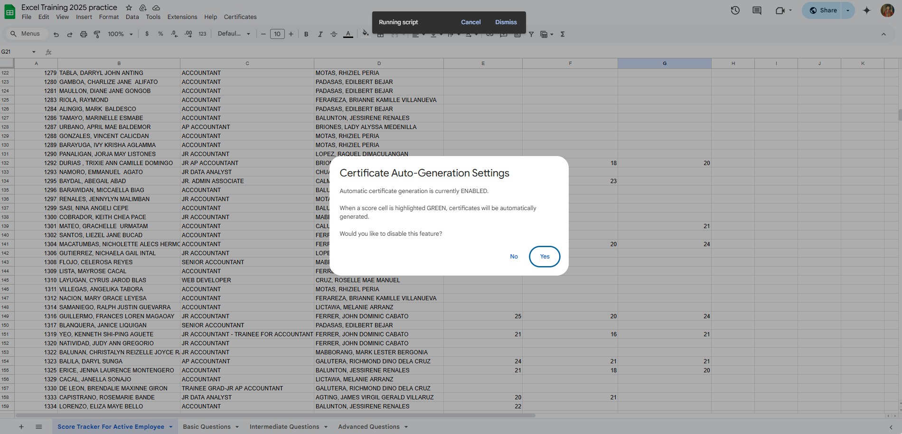

# Certificate Automation Script for Excel Training

This project is a Google Apps Script designed to automate the generation and emailing of certification documents for **Excel Training** based on employee performance data in a Google Sheet. The script integrates with Google Sheets, Google Drive, and Gmail to streamline the certification process.

---

## Features

1. **Automatic Certificate Generation**:
   - Certificates are generated when a score cell is highlighted green in the Google Sheet.
   - Supports three certification levels: Basic, Intermediate, and Advanced.

2. **Email Integration**:
   - Automatically emails the generated certificates to employees.
   - Includes a customizable email template with a professional signature and branding.

3. **Duplicate Prevention**:
   - Checks for existing certificates in Google Drive to avoid duplicates.

4. **Customizable Settings**:
   - Enable or disable automatic certificate generation.
   - Enable or disable automatic email sending.

5. **Bulk Certificate Generation**:
   - Generate certificates for all employees or specific certification levels.

6. **Status Column Updates**:
   - Tracks the progress of certificate generation and email sending in a designated status column:
     - **"Certificate already sent to [email]"**: Indicates that the certificate has already been emailed.
     - **"Generating Certificate"**: Indicates that the certificate is being generated.
     - **"Failed Score"**: Indicates that the score did not meet the required threshold.
     - **"Error during certificate generation"**: Indicates an error occurred during the process.
     - **"Certificate is available (Email not sent - auto-email disabled)"**: Indicates that the certificate has been generated and saved to Google Drive but not emailed.

---

## Additional Notes

- Certificates that are generated but not yet sent will only be saved to Google Drive. The status for such certificates will be **"Certificate is available (Email not sent - auto-email disabled)"**.
- To send these certificates to the employee's email, you need to first enable the **Email Auto-Sending** option in the **Certificate UI Menu**. After that, generate the certificates again (e.g., **Generate Basic Certificates**). Don't worry, it will not generate a new certificate; instead, it will send the certificate that has already been generated but not yet sent to the employee's email.
- To generate certificates for specific types (e.g., Basic, Intermediate, or Advanced), select the corresponding option in the **Certificate UI Menu** based on the type of exam you want to generate the certificate for.
- If you want to generate certificates but not send them to the employee's email, disable the **Email Auto-Sending** option in the **Certificate UI Menu** and generate certificates by types (e.g., **Generate Basic Certificates**).
- Once the certificate is sent, the status will update to **"Certificate already sent to [email]"** (e.g., **"Certificate already sent to reysanbarillo3@gmail.com"**).

---

## Screenshots

### 1. **Certificate Auto-Generation Settings**


### 2. **Email Auto-Sending Settings**


### 3. **Custom Menu for Certificates**


### 4. **Basic Questions Sheet**


### 5. **Score Tracker for Active Employees**


### 6. **Generated Email Example**


### 7. **Generated Certificates in Google Drive**


### 8. **Status Column Updates**


---

## File Structure

```
Automation/
├── Automation.js
├── images/
    ├── certificate-auto-generation-settings.png
    ├── email-auto-sending-settings.png
    ├── custom-menu-for-certificates.png
    ├── basic-questions-sheet.png
    ├── score-tracker-for-active-employees.png
    ├── generated-email-with-footer.png
    ├── generated-certificates-in-google-drive.png
    ├── status-column-updates.png
```

### Key File:
- **Automation.js**: Main script file containing the logic for certificate generation, email sending, and menu integration.

---

## Setup Instructions

### 1. **Prerequisites**
   - A Google Workspace account with access to Google Sheets, Google Drive, and Gmail.
   - A Google Sheet with employee data, including names, scores, and email addresses.

### 2. **Open Google Apps Script**
   - Open the Google Sheet where you want to use this script.
   - Navigate to `Extensions > Apps Script`.

### 3. **Add the Script**
   - Copy the contents of Automation.js and paste it into the Apps Script editor.

### 4. **Set Up Google Drive Folders**
   - Create folders in Google Drive for storing certificates:
     - Basic Certificates
     - Intermediate Certificates
     - Advanced Certificates
   - Update the folder IDs in the script:
     ```javascript
     const BASIC_TEMPLATE_ID = 'YOUR_BASIC_TEMPLATE_ID';
     const INTERMEDIATE_TEMPLATE_ID = 'YOUR_INTERMEDIATE_TEMPLATE_ID';
     const ADVANCED_TEMPLATE_ID = 'YOUR_ADVANCED_TEMPLATE_ID';
     ```

### 5. **Set Up Email Templates**
   - Customize the email subject and body in the script:
     ```javascript
     const EMAIL_SUBJECT_TEMPLATE = '%s Certification Training Completed';
     const getHtmlEmailBody = (name, examType) => `
       <div style="font-family: Arial, sans-serif; line-height: 1.6;">
         <p>Dear ${name},</p>
         <p>Congratulations on successfully completing the Excel ${examType} Certification Training.</p>
         <p>We are pleased to present your official certification document, which is attached to this email.</p>
         <p>Best regards,</p>
         <p>Training Certification Team</p>
       </div>`;
     ```

### 6. **Authorize the Script**
   - Save the script and run any function (e.g., `onOpen`) to trigger the authorization process.
   - Grant the necessary permissions.

### 7. **Enable Triggers**
   - Set up a trigger for the `onEdit` function to monitor changes in the Google Sheet:
     - Go to `Triggers` in the Apps Script editor.
     - Add a new trigger for `onEdit`.

---

## Usage

### 1. **Custom Menu**
   - After setup, a new menu called `Certificates` will appear in the Google Sheet.
   - Use this menu to:
     - Generate certificates for all employees or specific levels.
     - Enable/disable automatic certificate generation.
     - Enable/disable automatic email sending.

### 2. **Highlight Cells**
   - Highlight a score cell green to trigger certificate generation.

### 3. **Status Column**
   - The script updates the status column to track the progress of certificate generation and email sending:
     - **"Certificate already sent to [email]"**: Indicates that the certificate has already been emailed.
     - **"Generating Certificate"**: Indicates that the certificate is being generated.
     - **"Failed Score"**: Indicates that the score did not meet the required threshold.
     - **"Error during certificate generation"**: Indicates an error occurred during the process.
     - **"Certificate is available (Email not sent - auto-email disabled)"**: Indicates that the certificate has been generated and saved to Google Drive but not emailed.

### 4. **View Logs**
   - Use the `Logger.log` statements in the script to debug or monitor the process.

---

## Customization

### 1. **Email Footer**
   - Modify the footer in the email template to match your organization's branding.

### 2. **Certificate Templates**
   - Update the Google Doc templates for each certification level with placeholders:
     - `<<NAME>>` for the employee's name.
     - `<<DATE>>` for the certification date.

### 3. **Menu Options**
   - Add or remove menu options in the `onOpen` function as needed.

---

## Troubleshooting

### 1. **Certificates Not Generating**
   - Ensure the `AUTO_CERT_GENERATION_ENABLED` property is set to `true`.
   - Verify the folder IDs and template IDs in the script.

### 2. **Emails Not Sending**
   - Ensure the `AUTO_EMAIL_ENABLED` property is set to `true`.
   - Check the email addresses in the Google Sheet.

### 3. **Duplicate Certificates**
   - Ensure the script has access to the correct Google Drive folders.

---

## License

This project is licensed under the MIT License. You are free to use, modify, and distribute this script.

---

## Contact

For questions or support, please contact the Training Certification Team at `reysan.aretex@gmail.com`.

---